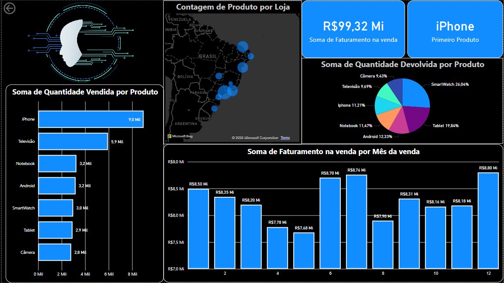

# 📊 Dashboard de Análise de Vendas de Produtos (Power BI)

Este repositório contém o meu **primeiro dashboard criado no Power BI!** 🎉 Ele oferece uma análise detalhada do desempenho de vendas e devoluções de diversos produtos, proporcionando insights valiosos sobre faturamento, volume de vendas e tendências mensais.

## ✨ Visão Geral do Dashboard

Este dashboard interativo foi desenvolvido para visualizar métricas chave de vendas. Ele aborda:

* **Faturamento Total:** Soma do faturamento gerado pelas vendas.
* **Performance de Vendas por Produto:** Quantidade vendida para cada tipo de produto (iPhone, TV, Notebook, etc.).
* **Análise de Devoluções por Produto:** Proporção de produtos devolvidos, destacando áreas para investigação.
* **Tendência de Faturamento Mensal:** Evolução do faturamento ao longo dos meses.
* **Distribuição Geográfica de Vendas:** Onde as vendas por loja estão concentradas.

## 🚀 Dashboard

## 🛠️ Tecnologias Utilizadas

* **Microsoft Power BI Desktop:** Ferramenta principal utilizada para a criação e visualização do dashboard.
* **Power Query:** Essencial para a **conexão, limpeza e transformação** dos dados brutos, garantindo a qualidade e o formato adequado para a análise.

## 🔗 Acesso ao Projeto

Você pode baixar o arquivo `.pbix` deste repositório para explorar o dashboard interativamente no Power BI Desktop.

* [`dashboard_vendas.pbix`](treinamento.pbix)

